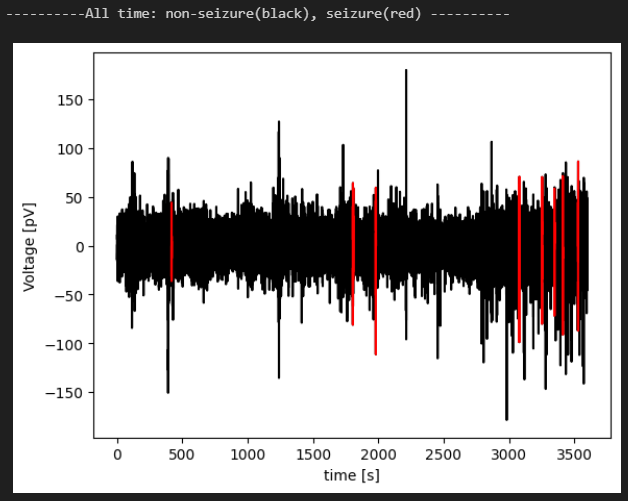
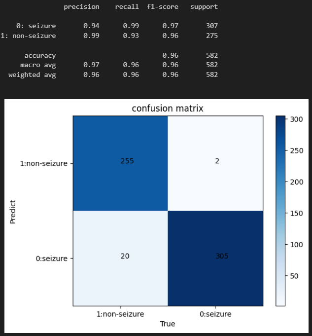

# EpilepticSeizureDetectionViaEEG
Epilepsy is a neurological disease that seriously affects physical health. In most hospitals, it is still mainstream for epilepsy to be diagnosed by experienced doctors by looking at electroencephalograms. However, epileptic seizure detection (ESD) is a very important and challenging task due to labor consumption, time cost, misdiagnosis and other reasons.

In this work, we propose a fast, accurate and robust algorithm based on discrete wavelet transform (DWT) and machine learning (ML) to implement ESD problems.

Finally, we obtained a cross-validation f1-score of 0.97 and a leave-one-out cross-validation f1-score of 0.91 on the CHB-MIT public dataset (Americans) and our own university hospital clinical data (Japanese).

(TBD) We have obtained permission from hospitals, patients, and companies, and are currently writing the paper for submission. 





# Usage

### Dependencies
```
numpy==1.21.6 # 1.24.1 cannot read a ndarray with the inhomogeneous shape 
seaborn
scipy
pandas
matplotlib
PyWavelets
mne
pyEDFlib
scikit-learn
xgboost
joblib
ipykernel
```

### Data
CHB-MIT can be downloaded [here](https://physionet.org/content/chbmit/1.0.0/). But we are sorry that we cannot provide our Japanese clinical data due to personal privacy issues.

### Train, validation and test
```
CHB-MIT_2_classification.ipynb
DataSection_2_classification.ipynb
```


